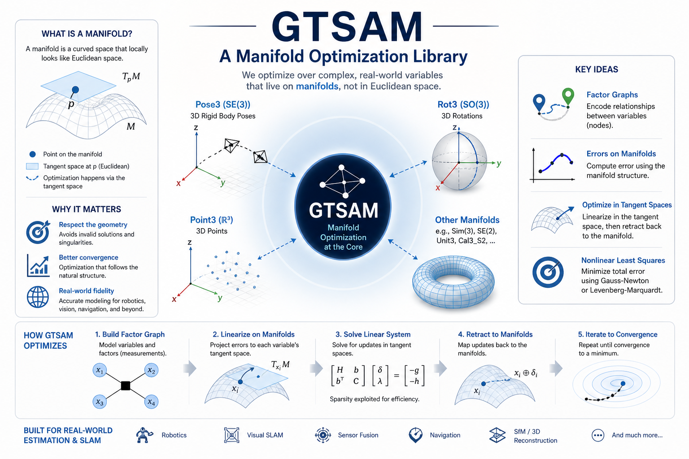

# GTSAM: Georgia Tech Smoothing and Mapping Library
[](https://gtsam.org/doxygen/)
[](https://borglab.github.io/gtsam/)

<p align="center">
  <a href="https://borglab.github.io/gtsam/">
    <picture>
      <source media="(prefers-color-scheme: dark)" srcset="doc/images/gtsam-manifold-optimization-dark.png">
      <source media="(prefers-color-scheme: light)" srcset="doc/images/gtsam-manifold-optimization-light.png">
      
    </picture>
  </a>
</p>

**Development branch**

The `develop` branch contains changes intended for the next GTSAM release and
may include API changes. For production use, choose the latest stable version
from the [GTSAM releases](https://github.com/borglab/gtsam/releases). Current
development builds require C++17; Boost support is optional and controlled by
CMake options.

## What is GTSAM?

GTSAM is a C++ library that implements smoothing and
mapping (SAM) in robotics and vision, using Factor Graphs and Bayes
Networks as the underlying computing paradigm rather than sparse
matrices.


<!-- Main CI Badges (develop branch) -->
| CI Status | Platform | Compiler |
|:----------|:---------|:---------|
| [](https://github.com/borglab/gtsam/actions/workflows/build-python.yml?query=branch%3Adevelop) | Ubuntu 22.04, macOS 15, Windows 2022 | GCC/Clang/MSVC |
| [](https://github.com/borglab/gtsam/actions/workflows/vcpkg.yml?query=branch%3Adevelop) | Latest Windows/Ubuntu/Mac | - |
| [](https://github.com/borglab/gtsam/actions/workflows/build-cibw.yml?query=branch%3Adevelop) | See [pypi files](https://pypi.org/project/gtsam-develop/#files); no Windows| - |

On top of the C++ library, GTSAM includes [wrappers for MATLAB & Python](#wrappers).


## Documentation

- **C++ API Docs:** [https://gtsam.org/doxygen/](https://gtsam.org/doxygen/)
- **Python API Docs:** [https://borglab.github.io/gtsam/](https://borglab.github.io/gtsam/)
- **CUDA linear solvers:** [doc/CUDA_LINEAR_SOLVERS.md](doc/CUDA_LINEAR_SOLVERS.md)
<!-- TODO: Perhaps include links to source code as well? But the wrappers doesn't really help too much understanding the source code. 
C++: https://github.com/borglab/gtsam/tree/develop/gtsam
Matlab wrapper: https://github.com/borglab/gtsam/blob/develop/matlab/README.md
Python wrapper https://github.com/borglab/gtsam/blob/develop/python/README.md
-->


## Quickstart

In the root library folder execute:

```sh
cmake -S . -B build
cmake --build build --target check  # optional, runs all unit tests
cmake --build build --target install
```

Prerequisites:

- [CMake](https://cmake.org/download/) 3.16 or newer
- A compiler with C++17 support. The continuously tested toolchains are:
    - Linux: GCC 11, 13, 14, or 15 and Clang 11, 14, or 16
    - macOS: Xcode 16
    - Windows: MSVC toolset 14.40

Older C++17-capable toolchains may work but are not continuously tested.

Optional Boost prerequisite:

Boost is optional. Two CMake flags govern its use:

- `GTSAM_USE_BOOST_FEATURES=ON|OFF` controls the remaining Boost-dependent features.
- `GTSAM_ENABLE_BOOST_SERIALIZATION=ON|OFF` controls Boost serialization of factor graphs, factors, and related types.

Both options default to ON for ordinary CMake builds and OFF inside ROS 2
`colcon` builds. If either option is ON, install
[Boost](https://www.boost.org/users/download/) 1.70 or newer:

- macOS: `brew install boost`
- Ubuntu: `sudo apt-get install libboost-all-dev`
- Windows: use [vcpkg](https://github.com/microsoft/vcpkg), or see
  [cmake/HandleBoost.cmake](cmake/HandleBoost.cmake) for manual-installation hints.

Optional prerequisites:

- [oneTBB](https://github.com/uxlfoundation/oneTBB) is searched for when
  `GTSAM_WITH_TBB=ON`, which is the default. On Ubuntu, install `libtbb-dev`.
- [Intel oneMKL](https://www.intel.com/content/www/us/en/developer/tools/oneapi/onemkl-download.html)
  is used only when `GTSAM_WITH_EIGEN_MKL=ON`. See [INSTALL.md](INSTALL.md) for
  setup instructions, and benchmark your workload with and without MKL.

## GTSAM 4 Compatibility

GTSAM 4 introduced Expressions, a Python toolbox, and traits that allow
optimization with non-GTSAM types. `Point2` and `Point3` are Eigen vector aliases;
their default constructors do not initialize their coefficients, so initialize
them explicitly before use.

`GTSAM_ALLOW_DEPRECATED_SINCE_V43` controls APIs deprecated for the GTSAM 4.3
release and defaults to ON. Disable it while migrating code to identify APIs
scheduled for removal after 4.3.


## Wrappers

We provide support for [MATLAB](matlab/README.md) and [Python](python/README.md) wrappers for GTSAM. Please refer to the linked documents for more details.

## Citation

If you are using GTSAM for academic work, please use the following citation:

```bibtex
@software{Dellaert26zenodo_GTSAM_4_3,
  author       = {Dellaert, Frank and GTSAM Contributors},
  title        = {GTSAM 4.3.0},
  month        = sep,
  year         = 2026,
  publisher    = {Zenodo},
  version      = {4.3.0},
  doi          = {10.5281/zenodo.22866773},
  url          = {https://doi.org/10.5281/zenodo.22866773},
}
```

To cite the `Factor Graphs for Robot Perception` book, please use:
```bibtex
@book{factor_graphs_for_robot_perception,
    author={Frank Dellaert and Michael Kaess},
    year={2017},
    title={Factor Graphs for Robot Perception},
    publisher={Foundations and Trends in Robotics, Vol. 6},
    url={http://www.cs.cmu.edu/~kaess/pub/Dellaert17fnt.pdf}
}
```

If you are using the IMU preintegration scheme, please cite:
```bibtex
@inproceedings{Forster-RSS-15,
    author    = {Christian Forster and Luca Carlone and Frank Dellaert and Davide Scaramuzza},
    title     = {IMU Preintegration on Manifold for Efficient Visual-Inertial Maximum-a-Posteriori Estimation},
    booktitle = {Proceedings of Robotics: Science and Systems},
    year      = {2015},
    address   = {Rome, Italy},
    month     = {July},
    doi       = {10.15607/RSS.2015.XI.006}
}
```


## The Preintegrated IMU Factor

GTSAM includes a state of the art IMU handling scheme based on

- Todd Lupton and Salah Sukkarieh, _"Visual-Inertial-Aided Navigation for High-Dynamic Motion in Built Environments Without Initial Conditions"_, TRO, 28(1):61-76, 2012. [[link]](https://ieeexplore.ieee.org/document/6092505)

Our implementation improves on this using integration on the manifold, as detailed in

- Christian Forster, Luca Carlone, Frank Dellaert, and Davide Scaramuzza, _"IMU Preintegration on Manifold for Efficient Visual-Inertial Maximum-a-Posteriori Estimation"_, Robotics: Science and Systems (RSS), 2015. [[link]](https://www.roboticsproceedings.org/rss11/p06.pdf)

If you are using the factor in academic work, please cite the publications above.

In GTSAM 4 a new and more efficient implementation, based on integrating on the NavState tangent space and detailed in [this document](doc/ImuFactor.pdf), is enabled by default. To switch to the RSS 2015 version, set the flag `GTSAM_TANGENT_PREINTEGRATION` to OFF.


## Additional Information

There is a [GTSAM users Google group](https://groups.google.com/forum/#!forum/gtsam-users) for general discussion.

Read about important [GTSAM concepts](doc/GTSAM-Concepts.md). A primer on
GTSAM Expressions, which support efficient automatic differentiation, is
available in [doc/expressions.md](doc/expressions.md).

See the [`INSTALL`](INSTALL.md) file for more detailed installation instructions. Our CI/CD process is detailed in [workflows.md](doc/workflows.md).

GTSAM is open source under the BSD license, see the [`LICENSE`](LICENSE) and [`LICENSE.BSD`](LICENSE.BSD) files.

Please see the [`examples/`](examples) directory and the [`USAGE`](USAGE.md) file for examples on how to use GTSAM.

GTSAM was developed in the lab of [Frank Dellaert](http://www.cc.gatech.edu/~dellaert) at the [Georgia Institute of Technology](http://www.gatech.edu), with the help of many contributors over the years, see [THANKS](THANKS.md).
