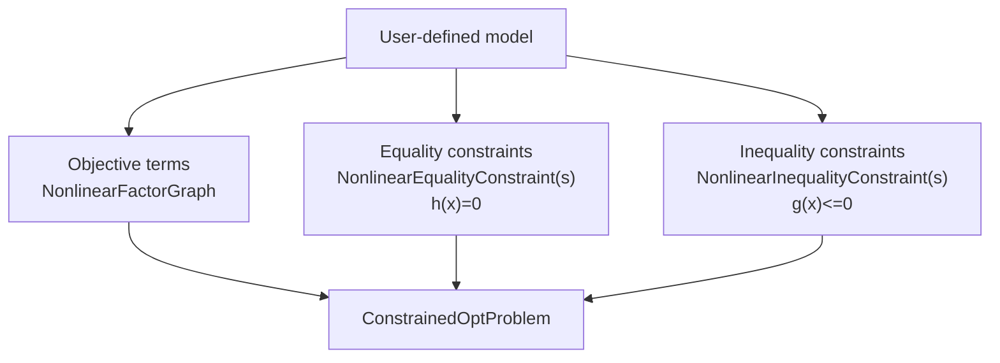
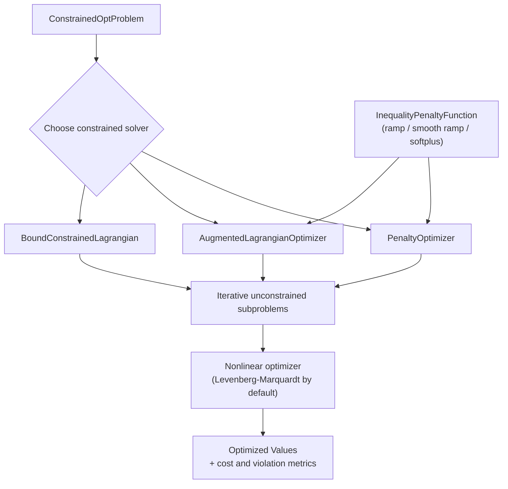

# Constrained

The `constrained` module in GTSAM provides constrained nonlinear optimization on top of factor graphs. It separates a problem into objective costs, equality constraints, and inequality constraints, then solves the resulting problem with penalty or augmented Lagrangian methods.

## Core Problem Model

- [`ConstrainedOptProblem`](doc/ConstrainedOptProblem.ipynb): Holds objective costs, equality constraints, and inequality constraints.
- [`ConstrainedOptProblem::AuxiliaryKeyGenerator`](doc/ConstrainedOptProblem.ipynb): Generates keys for auxiliary variables used when transforming inequality constraints.
- [`NonlinearConstraint`](doc/NonlinearConstraint.ipynb): Base class for nonlinear constraints represented as constrained `NoiseModelFactor` objects.

## Equality Constraints

- [`NonlinearEqualityConstraint`](doc/NonlinearEqualityConstraint.ipynb): Base class for constraints of the form `h(x) = 0`.
- [`ExpressionEqualityConstraint<T>`](doc/NonlinearEqualityConstraint.ipynb): Equality constraint from an expression and right-hand side.
- [`ZeroCostConstraint`](doc/NonlinearEqualityConstraint.ipynb): Equality constraint that enforces zero residual on a cost factor.
- [`NonlinearEqualityConstraints`](doc/NonlinearEqualityConstraint.ipynb): Container graph for equality constraints.

## Inequality Constraints

- [`NonlinearInequalityConstraint`](doc/NonlinearInequalityConstraint.ipynb): Base class for constraints of the form `g(x) <= 0`.
- [`ScalarExpressionInequalityConstraint`](doc/NonlinearInequalityConstraint.ipynb): Scalar expression-based inequality constraint.
- [`NonlinearInequalityConstraints`](doc/NonlinearInequalityConstraint.ipynb): Container graph for inequality constraints.
- [`InequalityPenaltyFunction`](doc/InequalityPenaltyFunction.ipynb): Interface for ramp-like penalty mappings used with inequality constraints.
  Derived classes:
  - [`RampFunction`](doc/InequalityPenaltyFunction.ipynb)
  - [`SmoothRampPoly2`](doc/InequalityPenaltyFunction.ipynb)
  - [`SmoothRampPoly3`](doc/InequalityPenaltyFunction.ipynb)
  - [`SoftPlusFunction`](doc/InequalityPenaltyFunction.ipynb)

## Optimizers

- [`ConstrainedOptimizerParams`](doc/ConstrainedOptimizer.ipynb), [`ConstrainedOptimizerState`](doc/ConstrainedOptimizer.ipynb), [`ConstrainedOptimizer`](doc/ConstrainedOptimizer.ipynb): Shared base interfaces and iteration state for constrained solvers.
- [`PenaltyOptimizerParams`](doc/PenaltyOptimizer.ipynb), [`PenaltyOptimizerState`](doc/PenaltyOptimizer.ipynb), [`PenaltyOptimizer`](doc/PenaltyOptimizer.ipynb): Classical penalty method solver and its parameters/state.
- [`AugmentedLagrangianParams`](doc/AugmentedLagrangianOptimizer.ipynb), [`AugmentedLagrangianState`](doc/AugmentedLagrangianOptimizer.ipynb), [`AugmentedLagrangianOptimizer`](doc/AugmentedLagrangianOptimizer.ipynb): Generic augmented Lagrangian solver and its parameters/state.
- [`BoundConstrainedLagrangianParams`](BoundConstrainedLagrangian.h), [`BoundConstrainedLagrangianState`](BoundConstrainedLagrangian.h), [`BoundConstrainedLagrangian`](BoundConstrainedLagrangian.h): Bound-constrained augmented Lagrangian variant with `eta` and `omega` thresholds for multiplier and penalty updates.

## How the Pieces Fit Together

For a new user, it helps to think in two phases:

1. Build a constrained problem.
2. Run a constrained solver on that problem.

Inequality constraints can use different smooth penalty shapes via
`InequalityPenaltyFunction` (ramp, smooth polynomial ramps, or softplus),
which controls behavior near the active constraint boundary.

### 1) Build the Problem

This stage is about modeling: you separate what you want to minimize
(objective terms) from what must hold (constraints), then combine them into a
single `ConstrainedOptProblem` object that the solvers can consume.

### 2) Solve the Problem

This stage is algorithmic: pick a constrained solver, form iterative
unconstrained subproblems internally, and solve those subproblems with a
standard nonlinear optimizer until constraint violation and cost are reduced.

## Algorithm Notes

### Penalty Method

`PenaltyOptimizer` forms a merit function

`f(x) + 0.5 * muEq * ||h(x)||^2 + 0.5 * muIneq * ||g(x)_+||^2`

and solves a sequence of unconstrained nonlinear least-squares problems. This is the simplest constrained solver in the module and is often the easiest baseline to reason about.

### Augmented Lagrangian Method

`AugmentedLagrangianOptimizer` adds explicit Lagrange multiplier updates on top of the penalty formulation. Equality multipliers are updated by dual ascent, and inequality multipliers are projected to remain nonnegative. The implementation builds the augmented Lagrangian directly as a factor graph.

### Bound-Constrained Augmented Lagrangian

`BoundConstrainedLagrangian` is a more specialized outer-loop strategy. Instead of always updating multipliers, it checks:

- the infinity norm of the cost gradient against `omega`
- the infinity norm of the equality constraint violation against `eta`

If the iterate is sufficiently stationary and feasible, it updates multipliers and tightens thresholds; otherwise, it increases the penalty parameter. See [`doc/BoundConstrainedLagrangian.md`](doc/BoundConstrainedLagrangian.md) for the detailed algorithm notes and code mapping.

## Supporting Implementation Notes

- [`AugmentedLagrangianFunction`](AugmentedLagrangian.h): Builds the augmented Lagrangian as a `NonlinearFactorGraph`.
- [`ConstrainedOptProblem::auxiliaryProblem`](ConstrainedOptProblem.h): Converts scalar inequality constraints into equality constraints with auxiliary variables when that formulation is useful.
- [`doc/BoundConstrainedLagrangian.md`](doc/BoundConstrainedLagrangian.md): Describes the Nocedal/Conn-style BCL globalization strategy used by `BoundConstrainedLagrangian`.

## Tests and Examples

The constrained module has focused unit tests in [`tests/`](tests/), including tests for constraints, penalty functions, the penalty optimizer, the augmented Lagrangian optimizer, and the bound-constrained Lagrangian optimizer. Small synthetic examples used by the tests live in [`tests/constrainedExample.h`](tests/constrainedExample.h).
